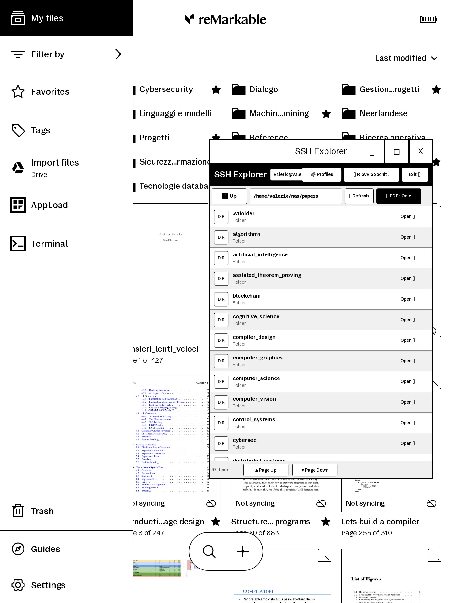

# SSH Explorer for reMarkable 2

**SSH Explorer** is a native file browser and PDF importer for **reMarkable** tablets, built on the [**AppLoad**](https://github.com/asivery/rm-appload) ([XOVI](https://github.com/asivery/xovi)) ecosystem. It allows you to browse remote file systems over SSH and download PDF documents directly into your reMarkable library.

<p align="center">
  
</p>

---

## Features

- **E-Ink Optimized UI:** High-contrast monochrome interface designed for minimal flicker, with dedicated Page Up / Page Down controls.
- **On-Screen Touch Keyboard:** Integrated virtual keyboard for typing hosts, paths, and credentials directly on the tablet.
- **Connection Profiles:** Save, test, and delete multiple SSH profiles stored in `~/.config/ssh-explorer/config.json`.
- **Fast Directory Traversal & Filters:** Browse remote folders with quick filter toggles for *PDFs Only* and *Hidden Files* (dotfiles), plus human-readable file sizes.
- **Fast PDF Import & Library Refresh:**
  - Downloads and writes PDF documents and metadata directly to reMarkable storage (`~/.local/share/remarkable/xochitl/`).
  - Offers a 1-tap **Restart xochitl now** button upon import to refresh the library immediately, or lets you continue browsing and restart later via the top-bar button.
- **Lightweight & Self-Contained:** No Python, Node.js, or heavyweight runtimes required on device. Powered by standard POSIX shell tools, Dropbear, and XOVI's CommandExecutor.

---

## Device Requirements

* **Device:** reMarkable 2 (OS 3.x / Yocto Linux armv7).
* **Installed Vellum packages:**
  * `appload`
  * `xovi` & `xovi-extensions`
  * `qt-command-executor`
  * `qt-resource-rebuilder`
* **SSH Client:** Dropbear (`dbclient` / `ssh`) with configured identity keys (e.g. `/home/root/.ssh/id_dropbear` or `id_rsa`).

---

## Architecture

```
┌────────────────────────────────────────────────────────┐
│             xochitl (reMarkable OS UI)                 │
│                          │                             │
│                  AppLoad Extension                     │
│                          │                             │
│    ┌─────────────────────▼───────────────────────┐     │
│    │               SSH Explorer                  │     │
│    │    (QML: ConnectionView, ExplorerView,      │     │
│    │     VirtualKeyboard, ImportModal)           │     │
│    └─────────────────────┬───────────────────────┘     │
│                          │ net.asivery.CommandExecutor │
│    ┌─────────────────────▼───────────────────────┐     │
│    │               ssh-helper.sh                 │     │
│    └─────────────┬───────────────────┬───────────┘     │
└──────────────────┼───────────────────┼─────────────────┘
                   │                   │
         [ Dropbear SSH / SCP ]        │ [ Direct Storage Write ]
                   │                   ▼
                   │         reMarkable Library
                   │     (/home/root/.../xochitl)
                   ▼
         [ Remote SSH Server ]
```

---

## Quick Start

### 1. Build the Package

Run on your computer (`rcc` required):
```bash
./build.sh
```
This packages QML resources into `dist/ssh-explorer/resources.rcc` and creates `dist/ssh-explorer.tar.gz`.

### 2. Deploy to reMarkable 2

Over USB (default IP `10.11.99.1`):
```bash
./deploy.sh
```

Or specify a Wi-Fi IP address:
```bash
./deploy.sh 192.168.1.150
```

### 3. Launch

1. Open the **AppLoad** launcher on your reMarkable tablet.
2. Tap **SSH Explorer** to launch full screen (or long-press to window).

---

## PC Desktop Preview

Test the interface locally on Linux with the tablet's native resolution:
```bash
cd preview
qmake && make
./preview-app
```

---

## Project Structure

```
ssh-explorer/
├── manifest.json              # AppLoad descriptor
├── application.qrc            # Qt resource descriptor
├── icon.png                   # Launcher icon (200x200)
├── ssh-helper.sh              # POSIX backend helper for SSH commands & import
├── build.sh                   # Build & packaging script
├── deploy.sh                  # One-step SSH deployment script
├── res/
│   └── screenshot.webp        # Application screenshot
├── ui/
│   ├── main.qml               # App root, state coordinator & top bar
│   ├── Style.qml              # E-Ink palette, metrics, and typography
│   ├── qmldir                 # QML module definition
│   ├── ConnectionView.qml     # Profile manager & connection form
│   ├── ExplorerView.qml       # Remote file browser & pagination
│   ├── VirtualKeyboard.qml    # On-screen touch keyboard
│   └── ImportModal.qml        # Download progress & import confirmation modal
└── preview/                   # Linux desktop Qt5 test runner
```
